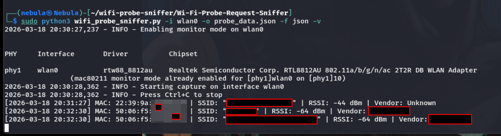
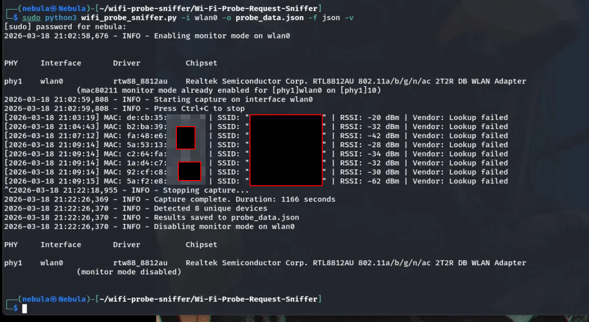

<div align="center">

# Wi-Fi Probe Request Sniffer

A Python tool for capturing and analyzing Wi-Fi probe requests from nearby devices.


[](https://www.python.org/)
[](https://scapy.net/)
[](https://www.linux.org/)
[](https://en.wikipedia.org/wiki/Monitor_mode)
[](https://www.aircrack-ng.org/)
[](https://en.wikipedia.org/wiki/IEEE_802.11)
[](https://macvendors.com/)
[](https://en.wikipedia.org/wiki/Comma-separated_values)
[](https://www.kali.org/)

</div>

## Overview

When wireless devices search for networks, they broadcast probe request frames containing information about previously connected networks. This tool captures these frames, extracts valuable data (SSIDs, MAC addresses), and displays/logs this information in real-time.

## Screenshots
### Basic Capture with Vendor Lookup


### Extended Capture with JSON Export



## Features

- Captures and analyzes wireless probe request frames
- Extracts network names (SSIDs) from these probe requests
- Identifies and logs device MAC addresses
- Displays real-time detection information in the terminal
- Runs on Linux systems with monitor-mode capable wireless adapters
- Deduplicates repeated requests from the same device
- Saves data to CSV or JSON format
- MAC address vendor lookup functionality

## Requirements

### System Requirements

- Linux system (Ubuntu, Kali, etc.)
- A wireless adapter that supports monitor mode
- Administrative privileges (sudo access)

### Python Requirements

- Python 3.x
- Scapy library
- Requests library (for vendor lookup)

## Installation

1. Clone this repository:
   ```bash
   git clone https://github.com/Rootless-Ghost/Wi-Fi-Probe-Request-Sniffer.git
   cd wifi-probe-sniffer
   ```

2. Install the required packages:
   ```bash
   sudo apt-get update
   sudo apt-get install -y python3-pip aircrack-ng
   pip3 install -r requirements.txt
   ```

## Usage

### Basic Usage

```bash
sudo python3 wifi_probe_sniffer.py -i wlan0
```

### Command Line Options

- `-i, --interface`: Wireless interface to use (must support monitor mode) [required]
- `-o, --output`: Output file to save results
- `-f, --format`: Output format (csv or json) [default: csv]
- `-d, --duration`: Capture duration in seconds
- `-v, --vendor-lookup`: Enable MAC address vendor lookup
- `-a, --all`: Capture all probe requests (including empty SSIDs)

### Examples

1. **Basic capture** - Show all probe requests on interface wlan0:
   ```bash
   sudo python3 wifi_probe_sniffer.py -i wlan0
   ```

2. **Save results to CSV file**:
   ```bash
   sudo python3 wifi_probe_sniffer.py -i wlan0 -o probe_data.csv
   ```

3. **Save results to JSON with vendor lookup**:
   ```bash
   sudo python3 wifi_probe_sniffer.py -i wlan0 -o probe_data.json -f json -v
   ```

4. **Capture for specific duration (5 minutes)**:
   ```bash
   sudo python3 wifi_probe_sniffer.py -i wlan0 -d 300
   ```

5. **Capture all probe requests (including empty SSIDs)**:
   ```bash
   sudo python3 wifi_probe_sniffer.py -i wlan0 -a
   ```

## Output Format

### Console Output

```
[2025-03-25 12:34:56] MAC: aa:bb:cc:dd:ee:ff | SSID: "Home_Network" | RSSI: -65 dBm | Vendor: Samsung Electronics
```

### CSV Format

```
mac_address,first_seen,last_seen,ssids,vendor,rssi
aa:bb:cc:dd:ee:ff,2025-03-25 12:34:56,2025-03-25 12:35:12,Home_Network,Samsung Electronics,-65
```

### JSON Format

```json
{
    "aa:bb:cc:dd:ee:ff": {
        "first_seen": "2025-03-25 12:34:56",
        "last_seen": "2025-03-25 12:35:12",
        "ssids": [
            "Home_Network"
        ],
        "vendor": "Samsung Electronics",
        "rssi": -65
    }
}
```

## Technical Notes

1. **Monitor Mode**: This tool requires your wireless adapter to be in monitor mode, which will be automatically enabled and disabled when you run the script.

2. **MAC Vendor Lookup**: The vendor lookup feature uses the macvendors.com API, which has rate limits. For extensive scanning, consider downloading an OUI database file.

3. **Compatible Adapters**: Not all wireless adapters support monitor mode. Popular compatible adapters include those with Atheros AR9271 and Realtek RTL8812AU chipsets.


## Example of Improved Function Documentation
```python
def lookup_vendor(mac_address: str) -> str:
    """
    Look up the vendor of a MAC address using the macvendors.com API.
    
    Args:
        mac_address (str): The MAC address to look up in format "XX:XX:XX:XX:XX:XX"
        
    Returns:
        str: The vendor name if found, or status message ("Unknown", "Lookup failed")
        
    Raises:
        ConnectionError: If the API cannot be reached
        
    Note:
        This function has rate limiting built in to respect the API's usage policy
    """
    try:
        # Format MAC address to match API requirements (first 6 characters)
        mac_prefix = mac_address.replace(':', '').upper()[:6]
        response = requests.get(f"https://api.macvendors.com/{mac_prefix}", timeout=2)
        
        if response.status_code == 200:
            return response.text
        elif response.status_code == 429:  # Rate limited
            time.sleep(1)  # Respect rate limiting
            return "Rate limited"
        return "Unknown"
    except Exception:
        return "Lookup failed"

```
## Example of Error Handling Improvement
```pyton 
def process_packet(packet) -> Tuple[bool, Dict]:
    """Process a packet and extract probe request information."""
    try:
        if packet.haslayer(Dot11ProbeReq):
            # Extract MAC address
            mac_address = packet.addr2
            if not mac_address:
                logger.debug("Packet missing source MAC address")
                return False, {}
            
            # Extract timestamp
            timestamp = time.time()
            
            # Extract SSID from the probe request
            ssid = ""
            if packet.haslayer(Dot11):
                if packet[Dot11].info:
                    try:
                        ssid = packet[Dot11].info.decode('utf-8', errors='replace')
                    except UnicodeDecodeError:
                        logger.warning(f"Could not decode SSID for packet from {mac_address}")
                        ssid = "<Undecodable SSID>"
            
            # Get signal strength if available
            rssi = None
            if packet.haslayer(RadioTap):
                if hasattr(packet[RadioTap], 'dBm_AntSignal'):
                    rssi = packet[RadioTap].dBm_AntSignal
            
            # Create a record of the probe request
            probe_data = {
                'timestamp': timestamp,
                'datetime': datetime.fromtimestamp(timestamp).strftime('%Y-%m-%d %H:%M:%S'),
                'mac_address': mac_address,
                'ssid': ssid,
                'rssi': rssi
            }
            
            return True, probe_data
    except Exception as e:
        logger.error(f"Error processing packet: {e}")
    
    return False, {}

```
## Example of Input Validation
```python
def check_interface(interface: str) -> bool:
    """
    Validate if the specified wireless interface exists and is usable.
    
    Args:
        interface (str): The name of the wireless interface to check
        
    Returns:
        bool: True if the interface exists and is usable, False otherwise
    """
    # Check if interface name has valid characters
    if not re.match(r'^[a-zA-Z0-9_\-]+$', interface):
        print(f"{Colors.RED}[!] Invalid interface name: {interface}{Colors.END}")
        return False
        
    # Check if interface exists
    if not os.path.exists(f"/sys/class/net/{interface}"):
        print(f"{Colors.RED}[!] Interface {interface} does not exist{Colors.END}")
        return False
        
    # Check if interface is wireless
    try:
        with open(f"/sys/class/net/{interface}/type", 'r') as f:
            if f.read().strip() not in ['1', '803']:  # 1=Ethernet, 803=Monitor Mode
                print(f"{Colors.RED}[!] Interface {interface} is not a wireless interface{Colors.END}")
                return False
    except:
        print(f"{Colors.RED}[!] Cannot determine interface type for {interface}{Colors.END}")
        return False
        
    return True
```
## Legal and Privacy Considerations

- Capturing wireless traffic may be subject to legal restrictions in some jurisdictions. Only use this tool on networks you own or have permission to monitor.
- This tool captures MAC addresses which can potentially be used to track individuals. Consider anonymizing this data for ethical use.

## License

This project is licensed under the MIT License - see the [LICENSE](LICENSE) file for details.
